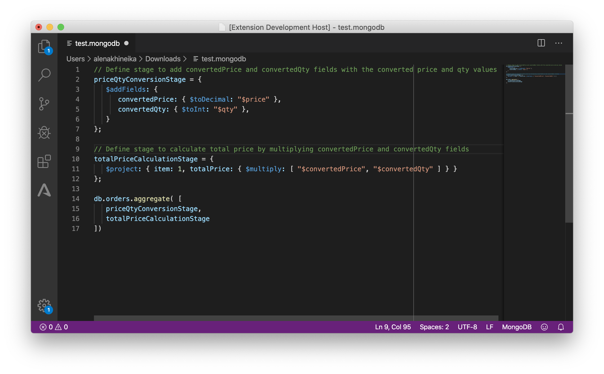

# VSCode MongoDB Language Extension

The MongoDB syntax support for VSCode extensions.

## How to install

The MongoDB Language Extension is not released. To start using this extension with VSCode copy it into the `<user home>/.vscode/extensions` folder and restart VSCode.

## Description

Since [the MongoDB Shell](https://docs.mongodb.com/manual/mongo/) language is a JavaScript-based query language that supports extended JSON, also called BSON, it is beneficial to reuse the existing JavaScript grammar and inject it with the MongoDB keywords. In this case:

- We get the JavaScript highlighting for free.
- We don't have to maintain a grammar with the JavaScript syntax.
- We can focus only on MongoDB keywords support.

E.g. [The VSCode JavaScript grammar](https://github.com/microsoft/vscode/tree/master/extensions/javascript/syntaxes) is derived from the [TypeScriptReact.tmLanguage](https://github.com/Microsoft/TypeScript-TmLanguage/blob/master/TypeScriptReact.tmLanguage) grammar.

The VSCode MongoDB Language extension injects the [TypeScript.tmLanguage](https://github.com/Microsoft/TypeScript-TmLanguage/blob/master/TypeScript.tmLanguage) grammar with MongoDB aggregation symbols support.
